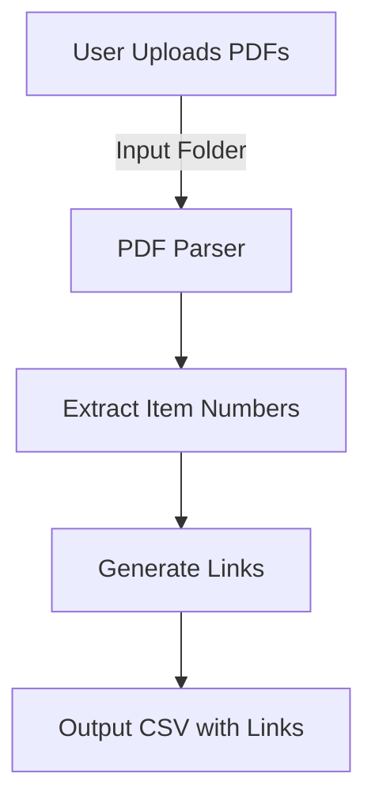

<h1 align="center">### 🚀 [PDF Item Number Extractor and Link Generator](https://github.com/ronknight/PDF-itemnumber-extractor-and-link-generator)</h1>

<h4 align="center">🔍 A Python-based tool to extract item numbers from PDF files and generate corresponding links for streamlined catalog or product management.</h4>

<p align="center">
  <a href="https://twitter.com/PinoyITSolution"></a>
  <a href="https://github.com/ronknight?tab=followers"></a>
  <a href="https://github.com/ronknight/PDF-itemnumber-extractor-and-link-generator/stargazers"></a>
  <a href="https://github.com/ronknight/PDF-itemnumber-extractor-and-link-generator/network/members"></a>
  <a href="https://youtube.com/@PinoyITSolution"></a>
  <a href="https://github.com/ronknight/PDF-itemnumber-extractor-and-link-generator/issues"></a>
  <a href="https://github.com/ronknight/PDF-itemnumber-extractor-and-link-generator/blob/master/LICENSE"></a>
  <a href="#"></a>
  <a href="https://github.com/ronknight"></a>
</p>

---

<p align="center">
  <a href="#project-overview">Project Overview</a> •
  <a href="#features">Features</a> •
  <a href="#installation">Installation</a> •
  <a href="#usage">Usage</a> •
  <a href="#visualization">Visualization</a> •
  <a href="#disclaimer">Disclaimer</a>
</p>

---

## 📋 Project Overview
The **PDF Item Number Extractor and Link Generator** is a Python tool designed to automate the process of extracting item numbers from PDF documents and generating direct links based on extracted data. This tool is especially useful for businesses that manage digital catalogs or product listings, allowing for faster indexing and reference.

## ✨ Features
- **PDF Parsing**: Extracts specific item numbers from each page of a PDF.
- **Custom Link Generation**: Automatically creates a link for each extracted item based on predefined URL templates.
- **Batch Processing**: Processes multiple PDFs in one run.
- **Error Handling**: Skips unreadable pages or items, logging errors for further review.

## ⚙️ Installation

1. **Clone the repository**:
   ```bash
   git clone git@github.com:ronknight/PDF-itemnumber-extractor-and-link-generator.git
   cd PDF-itemnumber-extractor-and-link-generator
   ```

2. **Install required packages**:
   Make sure you have Python 3.6+ installed. Then, install dependencies:
   ```bash
   pip install -r requirements.txt
   ```

## 🚀 Usage

1. **Place PDF Files**:
   Add PDF files to the `pdfs` folder or specify the path in the command.

2. **Run the Script**:
   ```bash
   python extract_and_link.py --input pdfs --output results.csv
   ```
   This command will process each PDF in the `pdfs` folder, extract item numbers, and generate links stored in `results.csv`.


## 📊 Visualization



## ⚠️ Disclaimer
This tool processes PDF files and generates external links. Ensure all data handling complies with your organization’s privacy policies and relevant regulations.